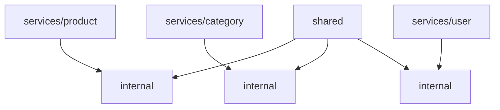
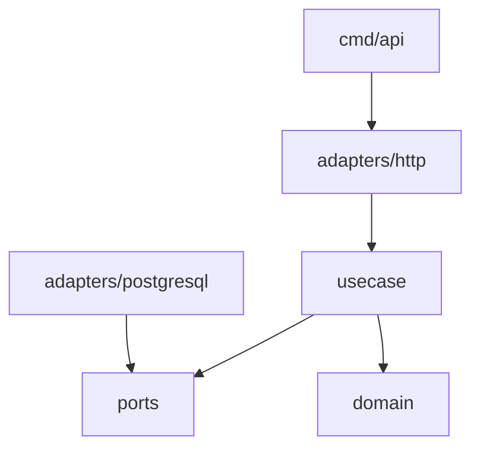

## Product Platform (Go Microservices)

Product, Category, and User/Auth services built with Go + Echo. Each service is isolated with its own database, and shared cross‑cutting concerns live under `shared/`.

---

### Table of Contents

- Overview
- Architecture
- Services and Ports
- Run (Docker)
- Environment Variables
- API Quick Test
- Tests

---

### Overview

This repository contains three microservices:

- `product-service` (port `8081`) — product CRUD
- `category-service` (port `8082`) — category CRUD
- `user-service` (port `8083`) — auth + user CRUD (JWT issuer)

Each service has its own PostgreSQL database.

---

### Architecture

**High-level structure**



**Inside each service (Clean Architecture aligned)**



**Why this structure matters**
- Clear boundaries and dependency inversion
- Easier testing (usecase depends on interfaces)
- Replaceable infrastructure per service

---

### Services and Ports

| Service | Port | Database | DB Port |
|---|---|---|---|
| product-service | 8081 | product_db | 6433 |
| category-service | 8082 | category_db | 6434 |
| user-service | 8083 | user_db | 6435 |

Prometheus: `http://localhost:9090`  
Grafana: `http://localhost:3000` (admin/admin)

---

### Run (Docker)

```bash
docker compose up --build product product-db category category-db user user-db prometheus grafana
```

---

### Environment Variables

All services use the same variable names:

- `DB_HOST`
- `DB_PORT`
- `DB_USER`
- `DB_PASSWORD`
- `DB_NAME`
- `DB_MAX_CONNECTIONS`
- `DB_MAX_IDLE_SECONDS`
- `JWT_SECRET`

Make sure `JWT_SECRET` is the same for all services so tokens are verifiable.

---

### API Quick Test

**Register** (user-service)
```bash
curl -X POST http://localhost:8083/api/v1/auth/register \
  -H "Content-Type: application/json" \
  -d '{"username":"john","email":"john@test.com","password":"secret123","first_name":"John","last_name":"Doe"}'
```

**Login** (token)
```bash
curl -X POST http://localhost:8083/api/v1/auth/login \
  -H "Content-Type: application/json" \
  -d '{"username_or_email":"john","password":"secret123"}'
```

**Create Category** (category-service, JWT required)
```bash
curl -X POST http://localhost:8082/api/v1/categories \
  -H "Authorization: Bearer <TOKEN>" \
  -H "Content-Type: application/json" \
  -d '{"name":"Electronics","description":"Devices"}'
```

**Create Product** (product-service, JWT required)
```bash
curl -X POST http://localhost:8081/api/v1/products \
  -H "Authorization: Bearer <TOKEN>" \
  -H "Content-Type: application/json" \
  -d '{"name":"AirFryer","price":1000,"description":"Digital air fryer","discount":10,"store":"ABC TECH","category_id":1}'
```

---

### Tests

Run all service tests:
```bash
go test ./services/... -v
```

Run per service:
```bash
go test ./services/product/... -v
go test ./services/category/... -v
go test ./services/user/... -v
```

---

### Notes

- Metrics endpoints are exposed at `/metrics` (e.g. `http://localhost:8081/metrics`).
- Prometheus scrapes all three services.
- Grafana is available on port `3000`.
