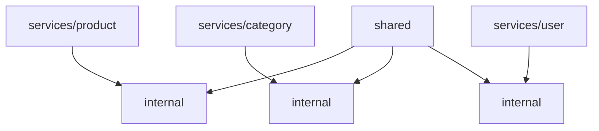
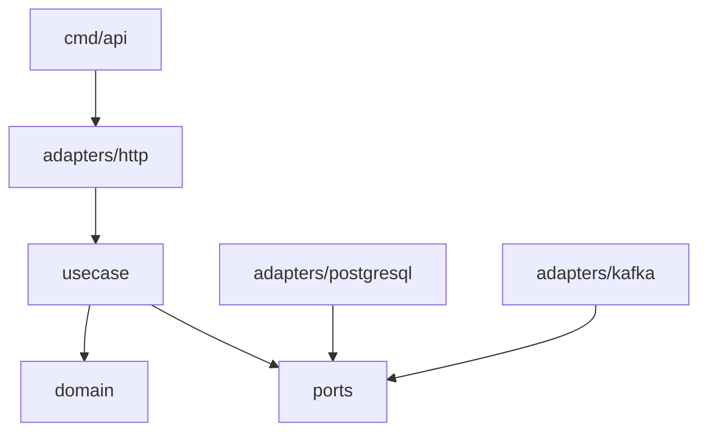
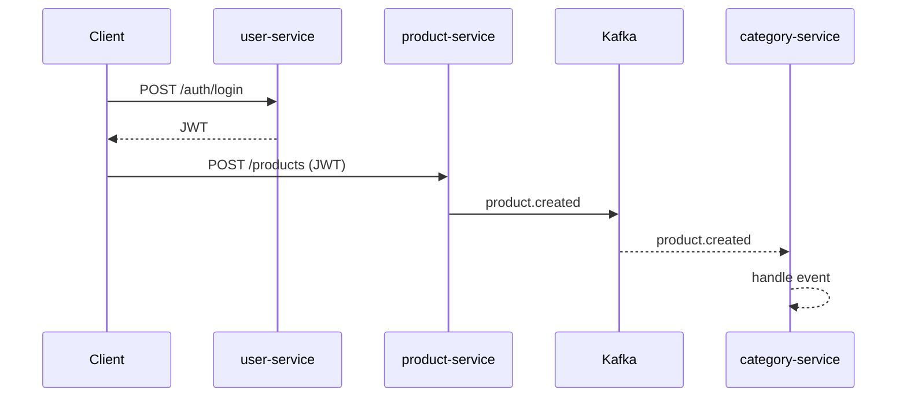

## Product Platform (Go Microservices)

Production‑oriented Go microservices with strict bounded contexts, isolated persistence, event streaming via Kafka, and metrics via Prometheus/Grafana. Each service follows a Clean Architecture layout (usecase → ports → adapters).

---

### Table of Contents

- Overview
- Architecture
- Service Map
- Run (Docker)
- Configuration
- Kafka Integration
- Observability
- API Quick Test
- Tests
- Troubleshooting

---

### Overview

**Services**
- `product-service` (port `8081`) — product CRUD, publishes domain events
- `category-service` (port `8082`) — category CRUD, consumes product events
- `user-service` (port `8083`) — auth + user CRUD, JWT issuer

**Infrastructure**
- PostgreSQL per service
- Kafka for event streaming
- Prometheus for metrics
- Grafana for dashboards

---

### Architecture

**Repository layout**



**Per‑service Clean Architecture**



**Event flow**



---

### Service Map

| Service | Port | Database | DB Port |
|---|---|---|---|
| product-service | 8081 | product_db | 6433 |
| category-service | 8082 | category_db | 6434 |
| user-service | 8083 | user_db | 6435 |

Kafka UI: `http://localhost:8089`  
Prometheus: `http://localhost:9090`  
Grafana: `http://localhost:3000` (admin/admin)

---

### Run (Docker)

```bash
docker compose up --build \
  kafka kafka-ui \
  product product-db \
  category category-db \
  user user-db \
  prometheus grafana
```

Stop:
```bash
docker compose down
```

---

### Configuration

All services accept the same config keys:

| Variable | Example | Purpose |
|---|---|---|
| `DB_HOST` | `product-db` | DB host inside compose network |
| `DB_PORT` | `5432` | DB port |
| `DB_USER` | `postgres` | DB user |
| `DB_PASSWORD` | `postgres` | DB password |
| `DB_NAME` | `product_db` | DB name |
| `DB_MAX_CONNECTIONS` | `10` | Pool size |
| `DB_MAX_IDLE_SECONDS` | `30` | Pool idle timeout |
| `JWT_SECRET` | `change-me-in-production` | JWT signing secret (shared) |
| `KAFKA_BROKERS` | `kafka:9092` | Kafka bootstrap |

**Notes**
- All services must share the same `JWT_SECRET`.
- `KAFKA_BROKERS` defaults to `kafka:9092` in compose.

---

### Kafka Integration

**Producer**
- `product-service` publishes to topic `product.events`.
- Publish happens after product creation.

**Consumer**
- `category-service` consumes `product.events`.
- Current handler logs messages; extend for projections/cache.

**Current event payload**
```json
{
  "name": "AirFryer",
  "price": 1000,
  "description": "Digital air fryer",
  "discount": 10,
  "store": "ABC TECH",
  "image_urls": [],
  "category_id": 1
}
```

**Recommended evolution**
- Add envelope fields: `event_type`, `event_version`, `occurred_at`.
- Keep stable schema to avoid breaking consumers.

---

### Observability

**Metrics endpoints**
- `http://localhost:8081/metrics`
- `http://localhost:8082/metrics`
- `http://localhost:8083/metrics`

**Prometheus**
- Scrapes services using `observability/prometheus.yml`.

**Grafana**
- Add Prometheus datasource: `http://prometheus:9090`.
- Import dashboards as needed.

---

### API Quick Test

**Register**
```bash
curl -X POST http://localhost:8083/api/v1/auth/register \
  -H "Content-Type: application/json" \
  -d '{"username":"john","email":"john@test.com","password":"secret123","first_name":"John","last_name":"Doe"}'
```

**Login**
```bash
curl -X POST http://localhost:8083/api/v1/auth/login \
  -H "Content-Type: application/json" \
  -d '{"username_or_email":"john","password":"secret123"}'
```

**Create Category**
```bash
curl -X POST http://localhost:8082/api/v1/categories \
  -H "Authorization: Bearer <TOKEN>" \
  -H "Content-Type: application/json" \
  -d '{"name":"Electronics","description":"Devices"}'
```

**Create Product**
```bash
curl -X POST http://localhost:8081/api/v1/products \
  -H "Authorization: Bearer <TOKEN>" \
  -H "Content-Type: application/json" \
  -d '{"name":"AirFryer","price":1000,"description":"Digital air fryer","discount":10,"store":"ABC TECH","category_id":1}'
```

**Verify Kafka event**
```bash
docker compose logs -f category
```
Expected log:
```
category-service received: {...}
```

---

### Tests

All services:
```bash
go test ./services/... -v
```

Per service:
```bash
go test ./services/product/... -v
go test ./services/category/... -v
go test ./services/user/... -v
```

---

### Troubleshooting

**Kafka fails to start / unhealthy**
```bash
docker compose down
docker compose up -d kafka kafka-ui
```
Ensure `CLUSTER_ID` is set in compose.

**JWT invalid between services**
- All services must share the same `JWT_SECRET`.

**Prometheus shows DOWN**
- Verify services are running and `/metrics` endpoints are reachable.


---

### Deployment / CI (Short)

- Build images locally: `docker compose build`
- Run tests in CI: `go test ./services/... -v`
- Release strategy: tag a commit and publish images from CI
